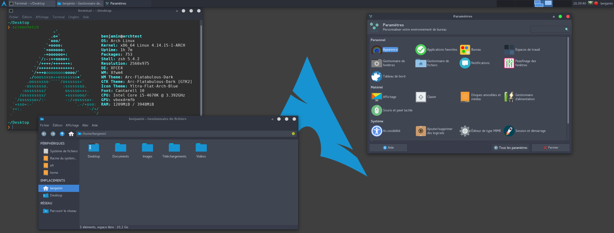

<!-- Fichier contenant les commandes pour installer Arch Linux sur une nouvelle machine -->
<!-- Configuration personnelle avec XFCE4 comme environnement de bureau et SDDM comme gestionnaire de connexion -->

## Liste des commandes pour installer Arch Linux (Mai 2018):


#### 1: Passer le clavier en français:
- loadkeys fr-pc (loqdkeys fr)pc en Qwerty)

#### 2: Vérification de la connexion au réseau:
- ip address show
- ping -c 3 8.8.8.8

#### 3: Passer l'horloge de la machine à l'heure française:
- timedatectl set-ntp true
- timedatectl set-timezone Europe/Paris

#### 4: Partionnement et formatage du disque:
###### 4.1: Partionnement
- fdisk /dev/sda (où la lettre qui correspond au disque d'installation)
	* taper 'p' pour afficher les partitions du disque
	* taper 'd' pour supprimer une partition (taper plusieurs fois pour supprimer plusieurs partitions)
	* taper 'n' pour créer une partition
		* taper 'p' pour sélectionner primary
		* laisser le programme choisir un numéro pour la partition
		* laisser le premier secteur de la partition par défaut
		* choisir la taille de la nouvelle partition en tapant +{taile}{lettre} (où les lettes sont [K, M, G, T, P])
	* taper 'w' pour écrire la table de partition sur le disque (supprime tout ce qu'il y a sur le disquelsblk)

###### 4.2: Table de partitions
| Nom  | taille | numéro | commentaire |
|------|--------|--------|-------------|
| boot | 200M   | sda1   | **X** |
| swap | 8G     | sda2   |2 fois la taille de la RAM|
| root | 15G    | sda3   |plus si beaucoup de programmes à installer|
| home | 30G    | sda4   |le reste du disque en général|

###### 4.3: Formatage et montage
- mkfs
	* mkfs.ext4 /dev/sda1
	* mkfs.ext4 /dev/sda3
	* mkfs.ext4 /dev/sda4
	* mkswap /dev/sda2 (swap)
- mount
	* swapon /dev/sda2 (swap)
	* mount /dev/sda3 /mnt (root)
	* mkdir /mnt/boot && mount /dev/sda1 /mnt/boot
	* mkdir /mnt/home && mount /dev/sda4 /mnt/home (home)

#### 5: Installation du système de base
###### 5.1: Mise à jour des dépôts
- mv /etc/pacman.d/mirrorlist /etc/pacman.d/mirrorlist.orig
- rankmirrors -n 6 /etc/pacman.d/mirrorlist.orig > /etc/pacman.d/mirrorlist  (si le programme ne rend pas la main, faire Ctrl-C)
- pacman -Syy

###### 5.2 Système de base
- pacstrap /mnt base base-devel

#### 6: Configuration de l'installation
###### 6.1: Fstab
- genfstab -U /mnt >> /mnt/etc/fstab

###### 6.2: Nom de la machine
- arch-chroot /mnt
- pacman -S networkmanager
- systemctl enable NetworkManager
- echo NomDeLaMachine > /etc/hostname
- echo '127.0.1.1 NomDeLaMachine.localdomain NomDeLaMachine' >> /etc/hosts

###### 6.3: Heure locale (si pas fait au début)
- ln -s /usr/share/zoneinfo/Europe/Paris /etc/localtime

###### 6.4: Modification de la langue du système et de la configuration du clavier
- nano /etc/locale.gen (décommenter la locale)
- locale-gen
- echo LANG="fr_FR.UTF-8" > /etc/locale.conf
- export LANG=fr_FR.UTF-8
- echo KEYMAP=fr > /etc/vconsole.conf

###### 6.5: RAMdisk
- mkinitcpio -p linux

###### 6.6: Modification du mot de passe de root
- passwd

#### 7: Installation d'un booloader (Grub)
###### 7.1: Téléchargement et installation
- pacman -S grub
- grub-install --target=i386-pc /dev/sda

###### 7.2: Généer le fichier de configuration
- grub-mkconfig -o /boot/grub/grub.cfg

###### 7.3: Terminer l'installation
- exit (pour quitter arch-chroot)
- umount -R /mnt (pour démonter les partitions)
- reboot (en retirant la clé USB pour éviter de rebooter sur l'installeur de Arch)

#### 8: Ajouter un utilisateur
- useradd -m -g wheel "nom utilisateur" (le groupe wheel est pour les utilisateurs administrateurs)
- passwd "nom utilisateur"
- décommenter la ligne %wheel ALL=(ALL) ALL dans /etc/sudoers

#### 9: Environnement de bureau
- pacman -Syu xorg-server xorg-xinit

##### 9.1: XFCE
- pacman -S xfce4 xfce4-goodies
- Ajouter 'exec xfce4' dans ~/.xinitrc

##### 9.2: i3
- pacman -S i3-gaps i3status i3lock rxvt-unicode dmenu
- Ajouter 'exec i3' dans ~/.xinitrc

##### 9.3: Gestionnaire de connexion
###### 9.3.1: LightDM
- pacman -S lightdm lightdm-gtk-greeter
- systemctl enable lightdm.service
- systemctl start lightdm.service

###### 9.3.2: SDDM
- pacman -S sddm
- systemctl enable sddm.service
- systemctl start sddm.service

#### 10: Setup de base (pour i3)
###### 10.1: Ajuster la résolution
- pacman -S xorg-xrandr arandr

Modifier la résolution en lançant arandr (voir le menu Ecrans/Résolution).

###### 10.2: Mettre le clavier en français dans le gestionnaire de connexion
- nano /etc/X11/xorg.conf.d/00-keyboard-layout.conf

```
Section "InputClass"
				Identifier												"Keyboard Layout"
				MatchIsKeyboard				"yes"
				Option														"XkbLayout"  "fr"
				Option														"XkbVariant"  "latin9"
EndSection
```

###### 10.3: Utilitaires
- pacman -S ranger thunar lxappearance

Ranger et Thunar sont explorateurs de fichiers.  
LXAppearance est un gestionnaire de thème (changement de thème, d'icones et de polices)

#### Extra
###### Fonts
- pacman -S noto-fonts ttf-linux-libertine ttf-inconsolata xorg-fonts-type1 ttf-dejavu artwiz-fonts font-bh-ttf font-bitstream-speedo gsfonts sdl_ttf ttf-bitstream-vera ttf-cheapskate ttf-liberation ttf-freefont ttf-arphic-uming ttf-baekmuk

###### Problème de tearing (déchirement)
- pacman -S xf86-video-intel (peut résoudre le problème)

###### Problème de connexion à internet
Si il y a des problèmes de connexion à internet pendant l'installation ou après le redémarrage, lancer les commandes suivantes:
- ip link set "nom interface" up
- systemctl enable dhcpcd.service
- systemctl start dhcpcd.service
