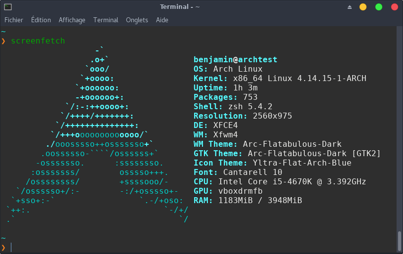

<!-- Fichier contenant les commandes pour insatller zsh comme shell par défaut -->

## Liste des commandes pour installer zsh


Le script "zsh_config.sh" permet de lancer toutes les commandes suivantes en une seule fois.

#### 1: Installation de Zsh
- sudo pacman -S zsh

#### 2: Lancement de Zsh
- zsh

#### 3: Installation de zim
Zim est un framework de configuration pour Zsh. Il permet de charger des extensions et de changer de thème.
- git clone --recursive https://github.com/zimfw/zimfw.git ${ZDOTDIR:-${HOME}}/.zim

#### 4: Configuration de Zim
Lancer les commandes suivantes directement dans un terminal:
```
for template_file ( ${ZDOTDIR:-${HOME}}/.zim/templates/* ); do
  user_file="${ZDOTDIR:-${HOME}}/.${template_file:t}"
  touch ${user_file}
  ( print -rn "$(<${template_file})$(<${user_file})" >! ${user_file} ) 2>/dev/null
done
```

#### 5: Zsh coomme shell par défaut
- chsh -s /bin/zsh benjamin
- chsh -s /bin/zsh

Remplacer "benjamin" par le nom de l'utilisateur concerné.

#### 6: Finalisation de la configuration
Dans un nouveau terminal:
- source \${ZDOTDIR:-\${HOME}}/.zlogin

Pour que la configuration soit complète, redémarrer le PC

#### 7: Changement de thème
Modifier la ligne ``` zprompt_theme='pure' ``` dans le fichier ``` ~/.zimrc ``` (ici application du thème "pure").
